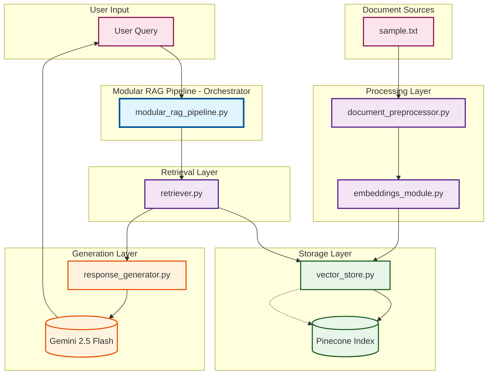
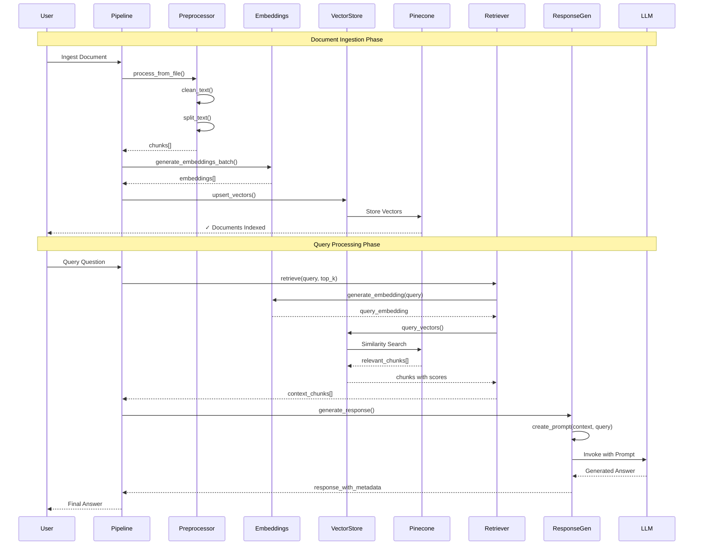
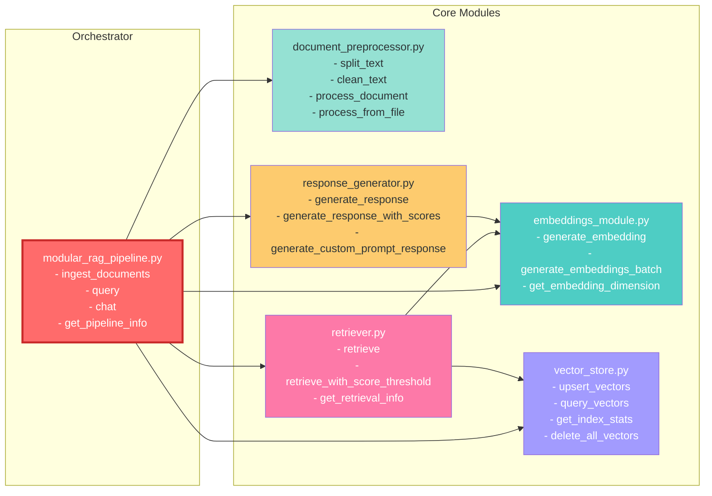
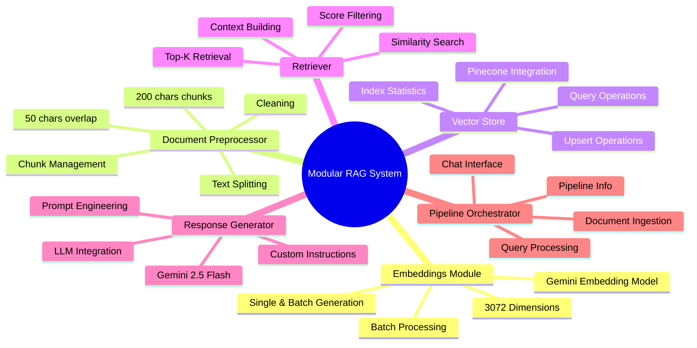
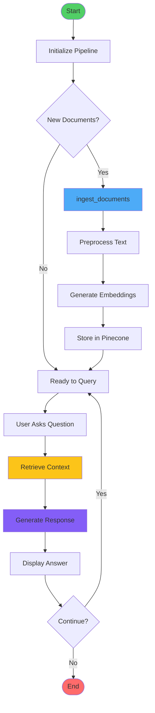

# Modular RAG System - Architecture Diagram

## System Architecture

```mermaid
graph TB
    subgraph "User Input"
        UI[User Query]
    end
    
    subgraph "Modular RAG Pipeline - Orchestrator"
        Pipeline[modular_rag_pipeline.py]
    end
    
    subgraph "Processing Layer"
        Preprocessor[document_preprocessor.py]
        Embeddings[embeddings_module.py]
    end
    
    subgraph "Storage Layer"
        VectorStore[vector_store.py]
        Pinecone[(Pinecone Index)]
    end
    
    subgraph "Retrieval Layer"
        Retriever[retriever.py]
    end
    
    subgraph "Generation Layer"
        ResponseGen[response_generator.py]
        LLM[(Gemini 2.5 Flash)]
    end
    
    subgraph "Document Sources"
        Doc[sample.txt]
    end
    
    %% Data Flow
    UI --> Pipeline
    Doc --> Preprocessor
    Preprocessor --> Embeddings
    Embeddings --> VectorStore
    VectorStore --> Pinecone
    Pipeline --> Retriever
    Retriever --> VectorStore
    VectorStore -.-> Pinecone
    Retriever --> ResponseGen
    ResponseGen --> LLM
    LLM --> UI
    
    %% Styling
    classDef orchestrator fill:#e1f5ff,stroke:#01579b,stroke-width:3px
    classDef processing fill:#f3e5f5,stroke:#4a148c,stroke-width:2px
    classDef storage fill:#e8f5e9,stroke:#1b5e20,stroke-width:2px
    classDef generation fill:#fff3e0,stroke:#e65100,stroke-width:2px
    classDef input fill:#fce4ec,stroke:#880e4f,stroke-width:2px
    
    class Pipeline orchestrator
    class Preprocessor,Embeddings,Retriever processing
    class VectorStore,Pinecone storage
    class ResponseGen,LLM generation
    class UI,Doc input
```

## Data Flow Diagram

```mermaid
sequenceDiagram
    participant User
    participant Pipeline
    participant Preprocessor
    participant Embeddings
    participant VectorStore
    participant Pinecone
    participant Retriever
    participant ResponseGen
    participant LLM
    
    Note over User,LLM: Document Ingestion Phase
    User->>Pipeline: Ingest Document
    Pipeline->>Preprocessor: process_from_file()
    Preprocessor->>Preprocessor: clean_text()
    Preprocessor->>Preprocessor: split_text()
    Preprocessor-->>Pipeline: chunks[]
    Pipeline->>Embeddings: generate_embeddings_batch()
    Embeddings-->>Pipeline: embeddings[]
    Pipeline->>VectorStore: upsert_vectors()
    VectorStore->>Pinecone: Store Vectors
    Pinecone-->>User: ✓ Documents Indexed
    
    Note over User,LLM: Query Processing Phase
    User->>Pipeline: Query Question
    Pipeline->>Retriever: retrieve(query, top_k)
    Retriever->>Embeddings: generate_embedding(query)
    Embeddings-->>Retriever: query_embedding
    Retriever->>VectorStore: query_vectors()
    VectorStore->>Pinecone: Similarity Search
    Pinecone-->>VectorStore: relevant_chunks[]
    VectorStore-->>Retriever: chunks with scores
    Retriever-->>Pipeline: context_chunks[]
    Pipeline->>ResponseGen: generate_response()
    ResponseGen->>ResponseGen: create_prompt(context, query)
    ResponseGen->>LLM: Invoke with Prompt
    LLM-->>ResponseGen: Generated Answer
    ResponseGen-->>Pipeline: response_with_metadata
    Pipeline-->>User: Final Answer
```

## Module Interaction Diagram

```mermaid
graph LR
    subgraph "Core Modules"
        E[embeddings_module.py<br/>- generate_embedding<br/>- generate_embeddings_batch<br/>- get_embedding_dimension]
        
        P[document_preprocessor.py<br/>- split_text<br/>- clean_text<br/>- process_document<br/>- process_from_file]
        
        V[vector_store.py<br/>- upsert_vectors<br/>- query_vectors<br/>- get_index_stats<br/>- delete_all_vectors]
        
        R[retriever.py<br/>- retrieve<br/>- retrieve_with_score_threshold<br/>- get_retrieval_info]
        
        G[response_generator.py<br/>- generate_response<br/>- generate_response_with_scores<br/>- generate_custom_prompt_response]
    end
    
    subgraph "Orchestrator"
        O[modular_rag_pipeline.py<br/>- ingest_documents<br/>- query<br/>- chat<br/>- get_pipeline_info]
    end
    
    O --> E
    O --> P
    O --> V
    O --> R
    O --> G
    R --> E
    R --> V
    G --> E
    
    style O fill:#ff6b6b,color:#fff,stroke:#c92a2a,stroke-width:3px
    style E fill:#4ecdc4,color:#fff
    style P fill:#95e1d3,color:#2d3436
    style V fill:#a29bfe,color:#fff
    style R fill:#fd79a8,color:#fff
    style G fill:#fdcb6e,color:#2d3436
```

## Component Details

```mermaid
mindmap
  root((Modular RAG System))
    Embeddings Module
      Gemini Embedding Model
      3072 Dimensions
      Batch Processing
      Single & Batch Generation
    
    Document Preprocessor
      Text Splitting
      Cleaning
      Chunk Management
      200 chars chunks
      50 chars overlap
    
    Vector Store
      Pinecone Integration
      Upsert Operations
      Query Operations
      Index Statistics
    
    Retriever
      Similarity Search
      Top-K Retrieval
      Score Filtering
      Context Building
    
    Response Generator
      Prompt Engineering
      LLM Integration
      Gemini 2.5 Flash
      Custom Instructions
    
    Pipeline Orchestrator
      Document Ingestion
      Query Processing
      Chat Interface
      Pipeline Info
```

## Use Case Flow

```mermaid
flowchart TD
    Start([Start]) --> Init[Initialize Pipeline]
    Init --> Check{New Documents?}
    Check -->|Yes| Ingest[ingest_documents]
    Check -->|No| QueryReady[Ready to Query]
    Ingest --> Process[Preprocess Text]
    Process --> Embed[Generate Embeddings]
    Embed --> Store[Store in Pinecone]
    Store --> QueryReady
    QueryReady --> UserQuery[User Asks Question]
    UserQuery --> Retrieval[Retrieve Context]
    Retrieval --> Generate[Generate Response]
    Generate --> Display[Display Answer]
    Display --> Continue{Continue?}
    Continue -->|Yes| QueryReady
    Continue -->|No| End([End])
    
    style Start fill:#51cf66
    style End fill:#ff6b6b
    style Ingest fill:#4dabf7
    style Retrieval fill:#fcc419
    style Generate fill:#845ef7
```
